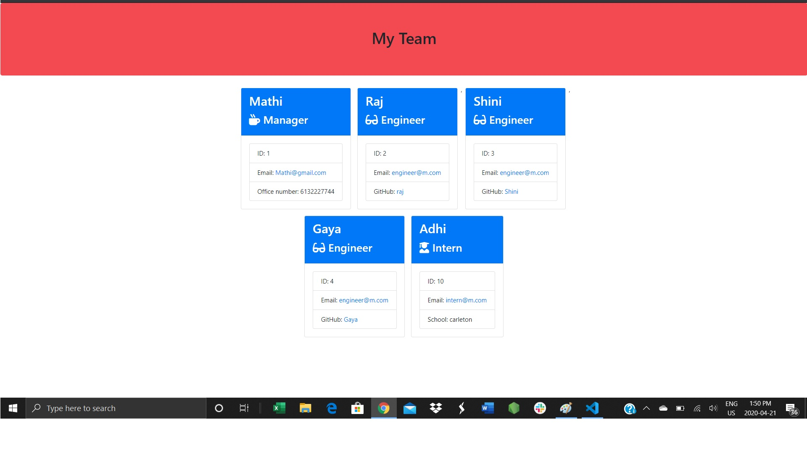

# Team_Generator

This Team Generator command line application used to generate a team dynamically based on the user input for a employment team structure such as Manager, Engineer and Intern employee/co-op student. A manager can have more than one engineer and intern employee/co-op student. This team member is build using classes such as Employee as base class, engineer and interm are the extended version of base class with additonal properties and methods assoicatae with it. This application uses HTML, CSS, Javascript, Node Js and inquirer and path, fs node packages.

In the command line user can provide answers based on predefined questions defined for each class and application will generate a output file team.html. 

The app can be invoked from command line by typing 'node app.js'.

video Link : https://drive.google.com/open?id=1cgCjyuKAaUH6Gu3vMd6bkkim3fKQOjEC

# 

